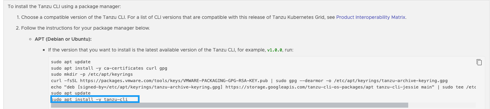

The bootstrap virtual machine that I utilised for the deploy of the TKG cluster was the market place Ubuntu 22.04 LTS image. Once deployed I performed the following steps to prepare the virtual machine for the TKG deployment.

- Installation of Azure Cli
- Installation of Docker Engine
- Installation of Tanzu Cli
- Installation 

# Installation of Azure Cli

```
curl -sL https://aka.ms/InstallAzureCLIDeb | sudo bash
```

References
https://learn.microsoft.com/en-us/cli/azure/install-azure-cli-linux?pivots=apt

# Installation of Docker Engine

Step 1: Add Docker's official GPG key
```
sudo apt-get update
sudo apt-get install ca-certificates curl
sudo install -m 0755 -d /etc/apt/keyrings
sudo curl -fsSL https://download.docker.com/linux/ubuntu/gpg -o /etc/apt/keyrings/docker.asc
sudo chmod a+r /etc/apt/keyrings/docker.asc
```

Step 2: Add the Docker repository to Apt sources
```
echo \
  "deb [arch=$(dpkg --print-architecture) signed-by=/etc/apt/keyrings/docker.asc] https://download.docker.com/linux/ubuntu \
  $(. /etc/os-release && echo "$VERSION_CODENAME") stable" | \
  sudo tee /etc/apt/sources.list.d/docker.list > /dev/null
sudo apt-get update
```

Step 3: Install latest Docker packages

```
sudo apt-get install docker-ce docker-ce-cli containerd.io docker-buildx-plugin docker-compose-plugin
```

Step 4: Create Docker group (should already exist)
```
sudo groupadd docker
```

Step 5: Add current user to Docker group
```
sudo usermod -aG docker $USER
```

Step 6: Activate changes to the group
```
newgrp docker
```

https://docs.docker.com/engine/install/ubuntu/
https://docs.docker.com/engine/install/linux-postinstall/

# Installation of Tanzu Cli

As per the Tanzu Cli [Product Interoperability Matrix](https://interopmatrix.vmware.com/Interoperability?col=1772,&row=0,) only Tanzu Cli **1.0.0** and **1.1.0** are supported for TKG **2.4.1**.


If you follow the below instructions, this will install the latest Tanzu Cli (1.2.0) which may cause issues.




To install Tanzu Cli 1.1.0 run the following commands.

```
sudo apt update
sudo apt install -y ca-certificates curl gpg
sudo mkdir -p /etc/apt/keyrings
curl -fsSL https://packages.vmware.com/tools/keys/VMWARE-PACKAGING-GPG-RSA-KEY.pub | sudo gpg --dearmor -o /etc/apt/keyrings/tanzu-archive-keyring.gpg
echo "deb [signed-by=/etc/apt/keyrings/tanzu-archive-keyring.gpg] https://storage.googleapis.com/tanzu-cli-os-packages/apt tanzu-cli-jessie main" | sudo tee /etc/apt/sources.list.d/tanzu.list
sudo apt update
sudo apt install -y tanzu-cli=1.1.0
```
