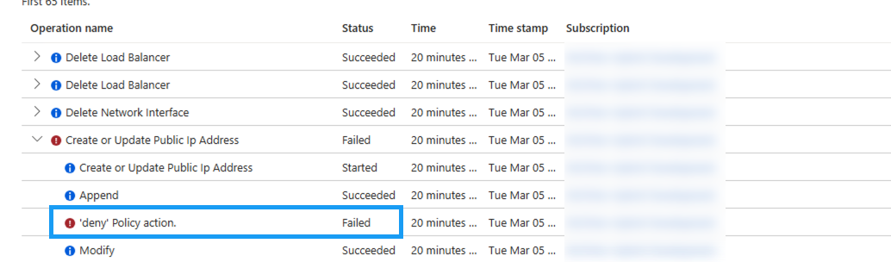

# Troubleshooting and Issues

- [Logs](#logs)
  - [TKG Deployment Logs](#tkg-deployment-logs)
  - [Azure Activty Logs](#azure-activity-logs)
- [Issues](#issues)
  - [I01: Error: edition not found](#i01-error-edition-not-found0

## Logs
[TKG Deployment Logs](#tkg-deployment-logs) 
[Azure Activty Logs](#azure-activity-logs)

###  TKG Deployment Logs

|File Name/Type|Location|Purpose|
|-----|-----|-----|

### Azure Activity Logs

The Azure activity logs on the resource group where the management and workload groups are being deployed to can provide useful information as to why deployment my be failing.

In the below explain, we can see that this deployment is failing because there is an Azure policy in place that prevents the creation on public IP's.

## Issues

### I01: Error: edition not found
When executing the *tanzu management-cluster create* 

