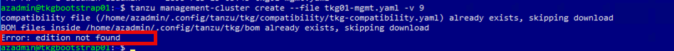
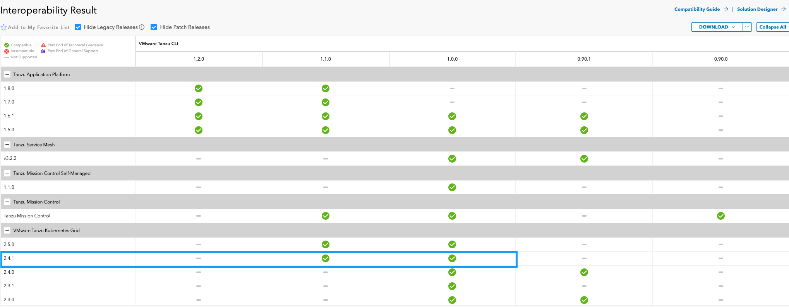

# Troubleshooting and Issues

- [Troubleshooting and Issues](#troubleshooting-and-issues)
  - [Logs](#logs)
    - [TKG Deployment Logs](#tkg-deployment-logs)
    - [Azure Activity Logs](#azure-activity-logs)
  - [Issues](#issues)
    - [I01: Error: edition not found](#i01-error-edition-not-found)
    - [I02: Route table not associated with subnet](#i02-route-table-not-associated-with-subnet)
    - [I03: Network Security Group not found](#i03-network-security-group-not-found)

## Logs
[TKG Deployment Logs](#tkg-deployment-logs)<br>
[Azure Activty Logs](#azure-activity-logs)

###  TKG Deployment Logs

|File Name/Type|Location|Purpose|
|-----|-----|-----|


### Azure Activity Logs

The Azure activity logs on the resource group where the management and workload groups are being deployed to can provide useful information as to why deployment my be failing.

In the below explain, we can see that this deployment is failing because there is an Azure policy in place that prevents the creation on public IP's.


## Issues

### I01: Error: edition not found
When executing the `tanzu management-cluster create` you receive the following error message `Error: edition not found'



This error is because Tanzu Cli 1.2.0 (or later) has been installed. TKG on Azure only supports Tanzu Cli 1.0.0 and 1.1.0.



To resolve this issue, install Tanzu Cli 1.1.0 using the following command.
```
sudo apt install -y tanzu-cli=1.1.0 --allow-downgrade
```

### I02: Route table not associated with subnet

### I03: Network Security Group not found