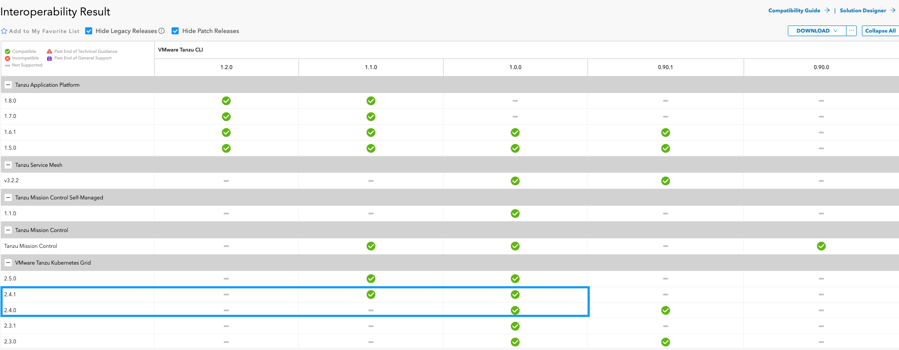
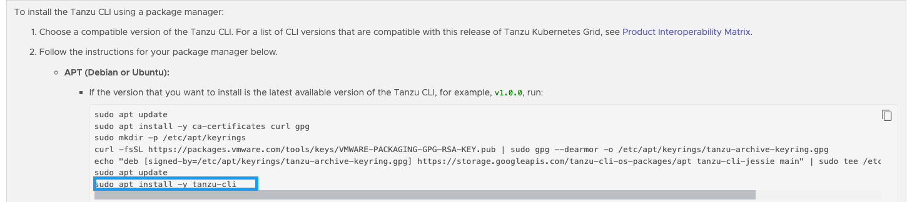

# Overview

The article will document the journey I went through deploying a VMware Tanzu Kubernetes Grid (TKG) onto Azure.

My objective was to:
- [x] Deploy an Azure Standalone Tanzu Kubernetes Grid Management Cluster
- [x] Append a Workload Cluster to the environment
- [x] Ensure that the cluster API are only accessible from within the vNet

To restrict the cluster API to within the vNet, the  TKG clusters need to be deployed as Private Clusters. By default, Azure management and workload clusters are public. They can be configure to be private, which means their API server uses an Azure internal load balancer (ILB) and is therefore only accessible from within the cluster’s own VNet or peered VNets

*[Tanzu Kubernetes Grid v2.4.x is the last version of TKG that supports the creation of TKG management and workload clusters on Azure. The ability to create TKG workload clusters on Azure will be removed in the Tanzu Kubernetes Grid v2.5 release.](https://docs.vmware.com/en/VMware-Tanzu-Kubernetes-Grid/2.4/tkg-deploy-mc/mgmt-release-notes.html)*

# Pre-Deployment Prerequisites

Prior to deploying the bootstramp virtual machine and TKG clusters, there are several prerequisites that need to be addressed:
- Creation of Service Principal
- Virtual Network Configuration
  - Subnets
  - Network Security Groups
- Internet Egress Requirements

## Creation of Service Principal
  
## Virtual Network Configuration

A subnet for the management cluster control plane node
A Network Security Group (NSG) in the cluster’s VNet resource group that is on the control plane subnet and has the following inbound security rules, to enable SSH and Kubernetes API server connections:
Allow TCP over port 22 for any source and destination
Allow TCP over port 6443 for any source and destination Port 6443 is where the Kubernetes API is exposed on VMs in the clusters you create. To change this port for a management or a workload cluster, set the CLUSTER_API_SERVER_PORT variable when deploying the cluster.
A subnet for the management cluster worker nodes
An NSG for the management cluster worker nodes that is in the cluster’s VNet resource group and on the cluster’s worker node subnet


https://docs.vmware.com/en/VMware-Tanzu-Kubernetes-Grid/2.4/tkg-deploy-mc/mgmt-reqs-prep-azure.html

### Subnet Configuration

### Network Security Groups

Tanzu Kubernetes Grid management and workload clusters on Azure require two Network Security Groups (NSGs) to be defined on their VNet and in their VNet resource group:

An NSG named CLUSTER-NAME-controlplane-nsg and associated with the cluster’s control plane subnet
An NSG named CLUSTER-NAME-node-nsg and associated with the cluster’s worker node subnet

Where CLUSTER-NAME is the name of the cluster.

Caution
Giving NSGs names that do not follow the format above may prevent deployment.

If you specify an existing VNet for the management cluster, you must create these NSGs as described in the General Requirements above. An existing VNet for a management cluster is specified with Select an existing VNet in the installer interface or AZURE_VNET_NAME in its configuration file.

If you do not specify an existing VNet for the cluster, the deployment process creates a new VNet and the required NSGs.

See the Microsoft Azure table in the Configuration File Variable Reference for how to configure the cluster’s VNet, resource groups, and subnets.


## Internet Egress Requirements

If you are utilising a firewall or proxy solution that requires URLs to explicitly Allowed through for internet egress, the below tables documents what I was able to capture.

### Azure
|URL|Ports|Purpose|Source|
|-----|-----|-----|-----|
|login.microsoftonline.com|443|Azure portal authentication|Bootstrap machine|
|*.aadcdn.msftauth.net|443|Azure portal authentication|Bootstrap machine|
|*.aadcdn.msftauthimages.net|443|Azure portal authentication|Bootstrap machine|
|*.aadcdn.msauthimages.net|443|Azure portal authentication|Bootstrap machine|
|*.logincdn.msftauth.net|443|Azure portal authentication|Bootstrap machine|
|login.live.com|443|Azure portal authentication|Bootstrap machine|
|*.msauth.net|443|Azure portal authentication|Bootstrap machine|
|*.aadcdn.microsoftonline-p.com|443|Azure portal authentication|Bootstrap machine|
|*.microsoftonline-p.com|443|Azure portal authentication|Bootstrap machine|
|*.portal.azure.com|443|Azure portal framework|Bootstrap machine|
|*.hosting.portal.azure.net|443|Azure portal framework|Bootstrap machine|
|*.reactblade.portal.azure.net|443|Azure portal framework|Bootstrap machine|
|management.azure.com|443| Azure portal framework|Bootstrap machine|
|*.ext.azure.com|443|Azure portal framework|Bootstrap machine|
|*.graph.windows.net|443|Azure portal framework|Bootstrap machine|
|*.graph.microsoft.com|443|Azure portal framework|Bootstrap machine|
|azure.archive.ubuntu.com|80, 443|Updating Ubuntu|Bootstrap machine |

https://learn.microsoft.com/en-us/azure/azure-portal/azure-portal-safelist-urls?tabs=public-cloud


### Docker 
|URL|Port|Purpose|Source|
|-----|-----|-----|-----|
|download.docker.com|443|Requires for the installation of Docker Engine|Bootstrap machine|
|api.segment.io|443|	Analytics|
|cdn.segment.com|443|	Analytics|
|api.wootric.com|443|	Analytics|
|cdn.wootric.com|443| Analytics|
|notify.bugsnag.com|443|	Error reports|
|sessions.bugsnag.com|443|	Error reports|
|auth.docker.io|443|	Authentication|
|cdn.auth0.com|443|	Authentication|
|login.docker.com|443|	Authentication|
|desktop.docker.com|443|	Update|
|hub.docker.com|443|	Docker Pull/Push|
|registry-1.docker.io|443|	Docker Pull/Push|
|production.cloudflare.docker.com|443|	Docker Pull/Push|
|docker-pinata-support.s3.amazonaws.com|433|	Troubleshooting|
|api.dso.docker.com|443|	Docker Scout service|

[https://docs.docker.com/engine/install/ubuntu/](https://docs.docker.com/desktop/allow-list/)

### VMware 
|Description|URL|Source|
|-----|-----|-----|
|projects.registry.vmware.com|VMware plugins registry hosts images, binaries and configuration files used by the Tanzu CLI to perform core functions like creating clusters and managing access. Tanzu Standard package repository stores images for packaged services that the Tanzu CLI installs into clusters.| Bootstrap machine|
|registry.tkg.vmware.run|Uses Harbor to host images that TKG uses to bootstrap management and workload clusters. Images in this registry are scanned for vulnerabilities and are safe to operate in all environments|Bootstrap machine|

https://docs.vmware.com/en/VMware-Tanzu-Kubernetes-Grid/2.4/tkg-deploy-mc/mgmt-reqs-proxy-allowlist.html

### Kind

*Optional if you would like to install Kind to view the clusters*

|URL|Purpose|Source|
|-----|-----|-----|
|kind.sigs.k8s.io||Bootstrap machine||
|github.com||Bootstrap machine|
|objects.githubusercontent.com||Bootstrap machine|

https://kind.sigs.k8s.io/docs/user/quick-start/

# Deployment

## Bootstrap Machine Preparation

### Azure Cli

Installation of Azure Cli onto bootstrap virtual machine

References
https://learn.microsoft.com/en-us/cli/azure/install-azure-cli-linux?pivots=apt

### Tanzu Cli

As per the Tanzu Cli [Product Interoperability Matrix](https://interopmatrix.vmware.com/Interoperability?col=1772,&row=0,) only Tanzu Cli **1.0.0** and **1.1.0** are supported for TKG **2.4.1**.



If you follow the below instructions, this will install the latest Tanzu Cli (1.2.0) which may cause issues.




To install Tanzu Cli 1.1.0 run the following commands.

```
sudo apt update
sudo apt install -y ca-certificates curl gpg
sudo mkdir -p /etc/apt/keyrings
curl -fsSL https://packages.vmware.com/tools/keys/VMWARE-PACKAGING-GPG-RSA-KEY.pub | sudo gpg --dearmor -o /etc/apt/keyrings/tanzu-archive-keyring.gpg
echo "deb [signed-by=/etc/apt/keyrings/tanzu-archive-keyring.gpg] https://storage.googleapis.com/tanzu-cli-os-packages/apt tanzu-cli-jessie main" | sudo tee /etc/apt/sources.list.d/tanzu.list
sudo apt update
sudo apt install -y tanzu-cli=1.1.0
```


# Issues
